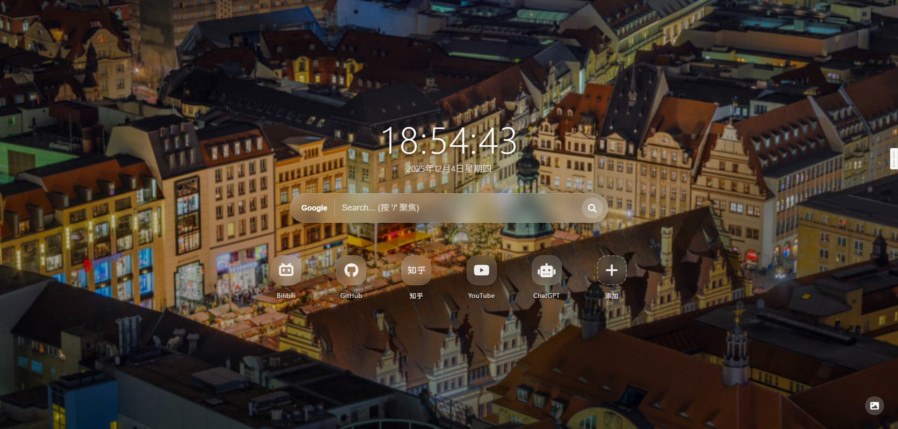

# ChengStartPage

一个极简、支持自定义图标和壁纸切换的 Chrome 新标签页扩展。

## 功能特性

- 🕐 实时时钟显示（包含日期）
- 🔍 多搜索引擎支持（Bing、Google、百度）
- 🖼️ 自动更换高清壁纸（来自必应每日精选）
- 📱 自定义网站快捷方式（支持 Font Awesome 图标）
- ⌨️ 快捷键支持（按 `/` 快速聚焦搜索框）
- 📱 响应式设计，适配各种屏幕尺寸
- 🌌 毛玻璃效果界面，美观现代

## 安装方法

### 方法一：从 Chrome 应用商店安装（推荐）
1. 访问 Chrome 网上应用店
2. 搜索 "ChengStartPage"
3. 点击 "添加至 Chrome"

### 方法二：开发者模式安装
1. 克隆或下载此仓库到本地
2. 打开 Chrome 浏览器，在地址栏输入 `chrome://extensions/`
3. 启用右上角的「开发者模式」
4. 点击「加载已解压的扩展程序」
5. 选择本项目所在的文件夹

## 使用说明

### 搜索功能
- 在搜索框中输入关键词进行搜索
- 支持三种搜索引擎切换：Bing、Google、百度
- 按 `/` 键快速聚焦搜索框
- 按 Enter 键直接搜索

### 壁纸功能
- 每次打开新标签页会自动加载一张新的必应每日精选壁纸
- 点击右下角的 🖼️ 按钮可手动切换壁纸

### 自定义图标
- 点击页面中的「添加」按钮可添加自定义网站快捷方式
- 可以为每个网站指定名称、网址和图标
- 图标支持 [Font Awesome](https://fontawesome.com/search?o=r&m=free) 中的免费图标
- 将鼠标悬停在已有图标上，点击出现的 ❌ 按钮可删除该图标

## 技术栈

- HTML5
- CSS3（含毛玻璃效果、响应式布局）
- JavaScript（ES6+）
- Font Awesome 6.4.0 图标库
- Chrome Extension Manifest V3

## 截图预览

*注：截图仅供参考，实际效果以最新版本为准*

## 许可证

MIT License

## 贡献者

- [你的名字]

## 联系方式

如有任何问题或建议，请通过以下方式联系：
- 提交 Issue
- 发送邮件至 [your-email@example.com]